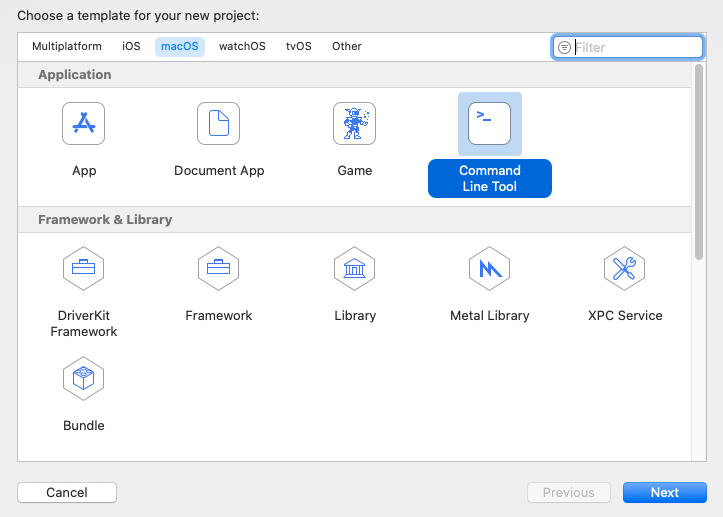
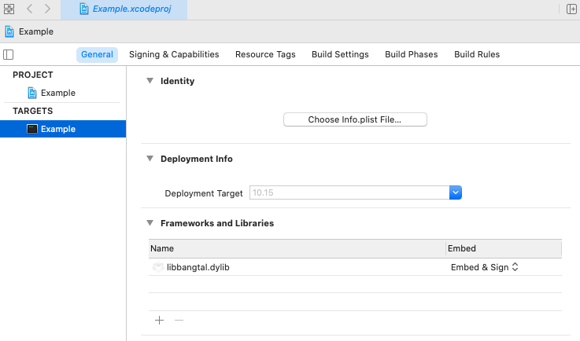
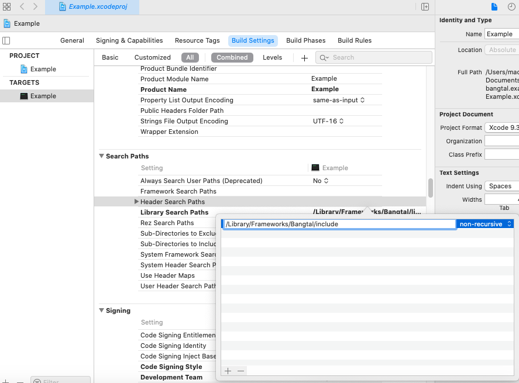
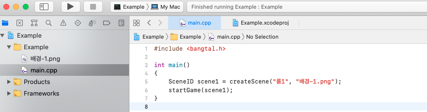
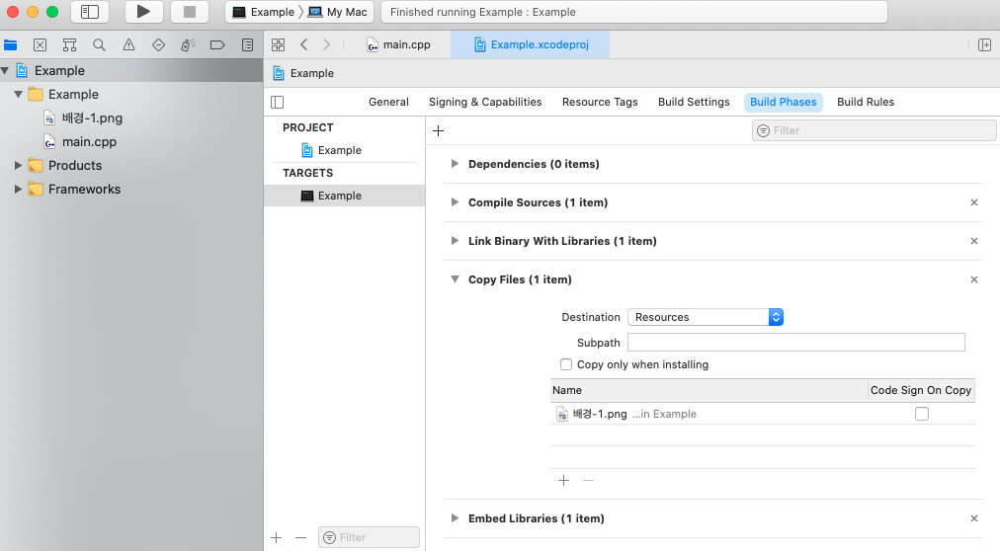

# bangtal.xcode

방탈 라이브러리로 Xcode를 사용해 게임을 만드는 방법은 다음과 같습니다.
1. 먼저 macOS 프로젝트를 "Command Line Tool"로 생성합니다.

2. 설치된 방탈 라이브러리를 사용하도록 포함합니다.
- 방탈 라이브러리(libbangtal.dylib) 포함하기

- 헤더 파일 경로 추가하기

3. 프로그램을 작성합니다. C/C++ 프로그램이므로 main.m을 main.cpp로 바꿔서 작성합니다.

4. 이미지 등 리소스를 추가합니다.

